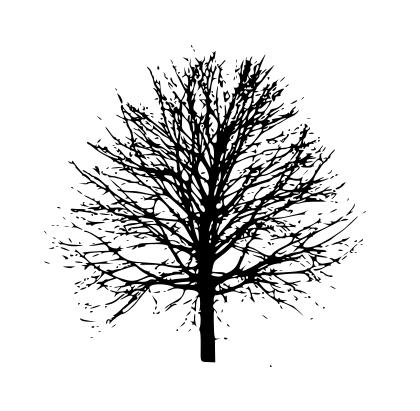

# Potrace

[](https://github.com/oslllo/potrace/actions)
[](https://www.npmjs.com/package/oslllo-potrace)

A "1:1 output" JavaScript port of [Potrace JS](https://github.com/kilobtye/potrace) for NodeJS.

---

| **Original image**        | **Potrace output**           |
|---------------------------|------------------------------|
|  |  |

---

[Online Demo](http://kilobtye.github.io/potrace/)

---

## Why did I create this package ❓

[The issue](https://github.com/tooolbox/node-potrace/issues/7)

---

# Prerequisites

- Node.js v10+

## Installation

```shell
npm install oslllo-potrace
```

## Basic Usage

---

Taken from [Example.js](https://github.com/oslllo/potrace/tree/master/example)

---

### Example 1

```js
const path = require("path");
const Potrace = require("..");
const fs = require("fs-extra");
const Svg2 = require("oslllo-svg2");

async function example1() {
    var source = path.resolve("example/tree.jpg");
    var destination = path.resolve("example/tree.svg");
    var traced = await Potrace(source).trace();
    fs.writeFileSync(destination, traced);
    await Svg2(traced).png().extend(10).toFile("example/tree.png");
}

example1().then(() => {
    console.log("done");
}).catch((err) => {
    throw err;
});
```

---

### Example 2

```js
const path = require("path");
const Potrace = require("..");
const fs = require("fs-extra");
const Svg2 = require("oslllo-svg2");

async function example2() {
    var source = path.resolve("example/tree.jpg");
    var destination = path.resolve("example/tree.svg");
    var instance = Potrace(source);
    var traced = await instance.trace();
    fs.writeFileSync(destination, traced);
    await Svg2(traced).png().extend(10).toFile("example/tree.png");
}

example2().then(() => {
    console.log("done");
}).catch((err) => {
    throw err;
});
```

---

### Parameters

- `source` ([**String**](https://developer.mozilla.org/docs/Web/JavaScript/Reference/Global_Objects/String) | [**Buffer**](https://nodejs.org/api/buffer.html)): path to `image` to trace.
- `options` ([**Object**](https://developer.mozilla.org/en-US/docs/Web/JavaScript/Reference/Global_Objects/Object)): option parameter object.
    - `turnpolicy` ([**string**](https://developer.mozilla.org/docs/Web/JavaScript/Reference/Global_Objects/String)): how to resolve ambiguities in path decomposition. available options are [ `Potrace.TURNPOLICY_BLACK`, `Potrace.TURNPOLICY_WHITE`, `Potrace.TURNPOLICY_LEFT`, `Potrace.TURNPOLICY_RIGHT`, `Potrace.TURNPOLICY_MINORITY`, `Potrace.TURNPOLICY_MAJORITY` ] **(default: Potrace.TURNPOLICY_MINORITY)**.
    - `turdsize`: ([**Number**](https://developer.mozilla.org/en-US/docs/Web/JavaScript/Reference/Global_Objects/Number)) suppress speckles of up to this size **(default: 2)**.
    - `optcurve`: ([**Boolean**](https://developer.mozilla.org/en-US/docs/Web/JavaScript/Reference/Global_Objects/Boolean)) turn on/off curve optimization **(default: true)**.
    - `alphamax`: ([**Number**](https://developer.mozilla.org/en-US/docs/Web/JavaScript/Reference/Global_Objects/Number)) corner threshold parameter **(default: 1)**.
    - `opttolerance`: ([**Number**](https://developer.mozilla.org/en-US/docs/Web/JavaScript/Reference/Global_Objects/Number)) curve optimization tolerance **(default: 0.2)**.
    - `svgSize`: ([**Number**](https://developer.mozilla.org/en-US/docs/Web/JavaScript/Reference/Global_Objects/Number)) set svg output size. ***NOTE:*** `The resulting image size` <b>=</b> `the original image size` <b>*</b> `size` **(default: 1)**.
    - `opt_type`: ([**String**](https://developer.mozilla.org/docs/Web/JavaScript/Reference/Global_Objects/String)) output svg type, available options are [`curve`]

## Changelog

Please see [CHANGELOG](https://github.com/oslllo/potrace/blob/master/CHANGELOG.md) for more information what has changed recently.

## Test

```shell
npm test
```

## Credits

[Potrace JS Port](https://github.com/kilobtye/potrace) by @kilobtye.

[Original Potrace](http://potrace.sourceforge.net/) by Peter Selinger.

[Another Potrace Port For Node.js](https://github.com/tooolbox/node-potrace) maintained by @tooolbox.

## License

The GNU General Public License v2.0 (GPL-2.0). Please see [License File](https://github.com/oslllo/potrace/blob/master/LICENSE) for more information.
